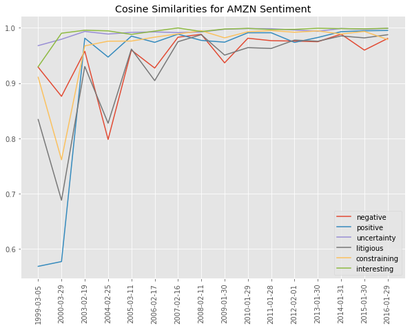
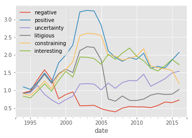
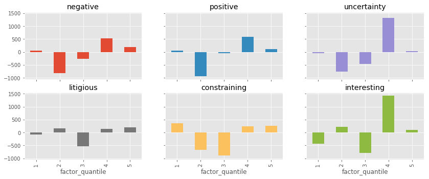

# NLP 10-K Statements

This Project:
 - analyzes 10-K text data to generate sentiment-based alpha factors
 - the text-based stock selection model was originally described in the paper [Lazy Prices by Lauren Cohen et al](https://papers.ssrn.com/sol3/papers.cfm?abstract_id=1658471)
     - *"Changes to the language and construction of financial reports also have strong implications for firms’ future returns: a portfolio that shorts “changers” and buys “non-changers” earns up to 188 basis points in monthly alphas (over 22% per year) in the future. Changes in language referring to the executive (CEO and CFO) team, regarding litigation, or in the risk factor section of the documents are especially informative for future returns"*
 - downloads annual 10-k filings through SEC's website for a select set of companies, and extract key sections for sentiment analysis
 
 

 

 
 
---

**note:** uses end of day from Quotemedia which could not be shared due to licensing restrictions
